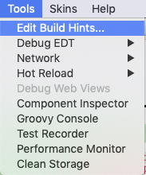
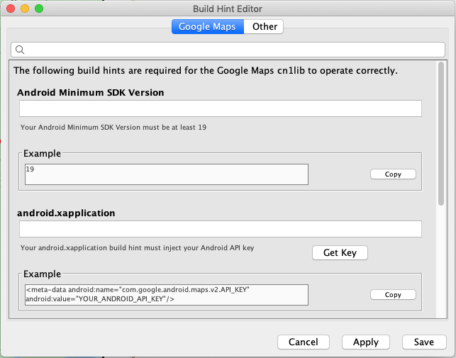

# Codename One Google Native Maps Support

Allows [Codename One](https://www.codenameone.com/) developers to embed native Google Maps on iOS/Android or
fallback to Codename One MapComponent on other platforms.
Check out a brief tutorial on using this project here:
https://www.codenameone.com/blog/new-improved-native-google-maps.html

## Installation

### Via Codename One Preferences

1. Open Codename One Preferences (i.e. Control Center)
2. Go to "Advanced Settings" > "Extensions" in the menu.
3. Find the "Codename One Google Native Maps" option.
4. Press "Download"

Back in your IDE (e.g. IntelliJ, NetBeans, Etc..) select the "Refresh Cn1libs" option in the Codename One menu.

### Maven Dependency

If you are using Maven as your build tool, then you can simply paste the following snippet into your common/pom.xml file:

~~~~
<dependency>
  <groupId>com.codenameone</groupId>
  <artifactId>googlemaps-lib</artifactId>
  <version>1.0.2</version>
  <type>pom</type>
</dependency>
~~~~

NOTE: You should replace the `version` with the [latest on Maven central](https://search.maven.org/artifact/com.codenameone/googlemaps-lib).

## Limitations
1. The native maps are only supported on Android devices that have the Google Play store (e.g. not on Amazon Kindle)
and on iOS devices. All other devices will show the MapComponent by default.
Map component will be used on the simulator as well.

2. Since a native component is used placing overlays is problematic. You will need to use Dialogs and the API's of the MapContainer class to implement this.

## Configuration

This library requires a few build hints in order to work properly.  Most of these are used to set the Google Maps API keys for the various target platforms.  You can use the Codename One Simulator's built-in Built-hint editor to add these build hints.  All you need to do is add an instance of `MapContainer` in your app's source, then launch the simulator.  

In the _Tools_ menu, select _Edit Build Hints..._



This will open a _Build Hint Editor_ window as shown below:



**TIP:** If don't see the "Google Maps" tab in your build hint editor, then your app hasn't tried to load a `MapContainer` instance yet.  Close the build hint editor, then navigate to the part of your app where you show a `MapContainer`.  Then open the Build Hint editor again.


The build hint editor will include four fields in the _Google Maps_ section:

- Android Minimum SDK Version
- android.xapplication
- ios.afterFinishLaunching
- JavascriptAPI Key

The fields will initially be blank, however, most fields will include an "Example" field just below it that includes some sample content that can be copied and pasted into the corresponding field as a starting point.  Some of the fields (e.g. _ios.afterFinishLaunching_ and _android.xapplication_) include placeholder text that you need to replace with your API key.

#### Obtaining API Keys

Some of the build hints require that you insert your own Google Maps API keys.  The _ios.afterFinishLaunching_ hint includes a placeholder for your iOS key.  The _android.xapplication_ hint includes a placeholder for your Android API key.  The Javascript API key field simply needs to contain your Javascript API key if you want to deploy your app via the Javascript port.

Below each of these fields, you'll see a "Get Key" button.  Each of these will open the associated Google web page with instructions on generating your key.


#### UWP
  
UWP uses [BingMaps](https://code.msdn.microsoft.com/windowsapps/Bing-Maps-for-Windows-10-d7ae3e44) instead of Google maps.  

You'll need to define the `windows.bingmaps.token` display property inside your app's init() method to your Bing Maps token.  See [instructons on generating a BingMaps token](https://code.msdn.microsoft.com/windowsapps/Bing-Maps-for-Windows-10-d7ae3e44).  E.g.

```java
Display.getInstance().setProperty("windows.bingmaps.token", "xxxxxxxxx");
```

#### iOS Pod Version

You can specify the iOS Google Maps version by setting the `var.ios.pods.GoogleMaps.version` build hint, using Cocoapods version syntax.  The default value is currently `~> 3.8`.  If you wish to use a newer version (e.g. `3.8`), then you'll need to set your `ios.pods.platform` build hint to a higher version, as newer versions of GoogleMaps have higher iOS version requirements.  `~> 2.0` requires iOS 8 or higher.  `~> 3.8` requires iOS 9. 

## Documentation

- [Javadocs](https://www.javadoc.io/doc/com.codenameone/googlemaps-common/latest/index.html)
- [Sample Maven Project](https://github.com/shannah/googlemaps-maven-demo)

## Building From Source

This project uses Maven as its build tool.

~~~~
git clone https://github.com/codenameone/codenameone-google-maps
cd codenameone-google-maps/GoogleMaps
mvn install
~~~~

This will install the library into your local maven repository so that you'll be able to add it as a dependency to any of your projects with the snippet:

~~~~
<dependency>
  <groupId>com.codenameone</groupId>
  <artifactId>googlemaps-lib</artifactId>
  <version>THE_VERSION</version>
  <type>pom</type>
</dependency>
~~~~

Just replace `THE_VERSION` with the version in the GoogleMaps/pom.xml file.

IMPORTANT: Notice that you include the `googlemaps-lib` artifact and not the `googlemaps` artifact when using it as a dependency.  The root "googlemaps" artifact is just a wrapper project for the multi-module project.  The "lib" module is the actual cn1lib dependency.

### Building Legacy .cn1lib File

Maven projects no longer use .cn1lib file format, however the project still builds this format in case you want to distribute the cn1lib without using Maven's dependency mechanisms (or if you want to use the library with the legacy Ant project type).  When you run `mvn install` it will automatically build the cn1lib file.  **You'll find it inside the common/target** directory after performing a build.

